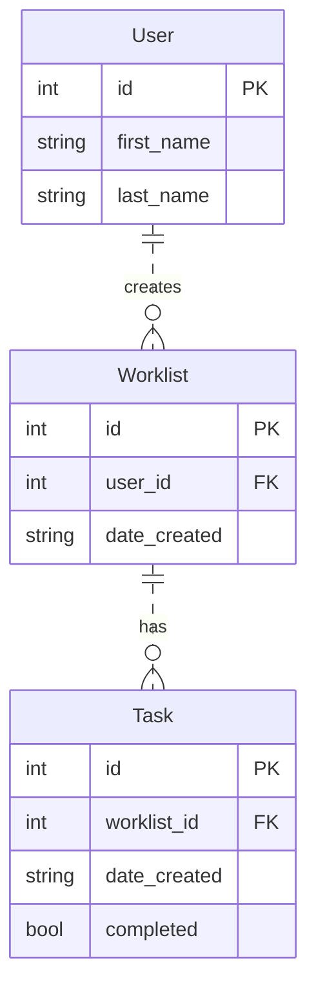

# My Todolist App

## Scripts

**Run App**

**Clear Tables and Data**

Enter `python -m todolist.db` to drop and clear all the tables

## Database Design

There are three tables crated in this app: `User`, `Worklist`, and `Task`. A `User` *creates* a `Worklist`. A `User` has zero or many `Worklist`(s). A user ca add a `Task` to a `Worklist` they own. The `Worklist` *has* a zero or many `Task`(s). 

